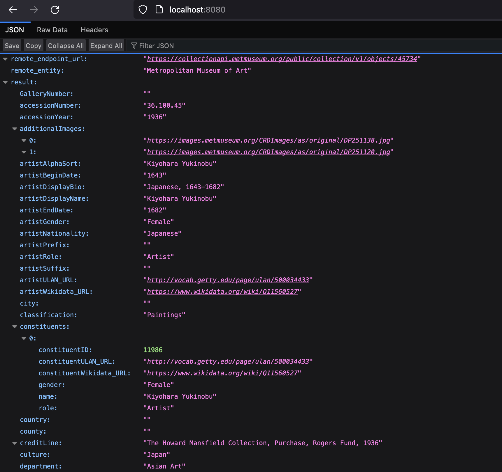
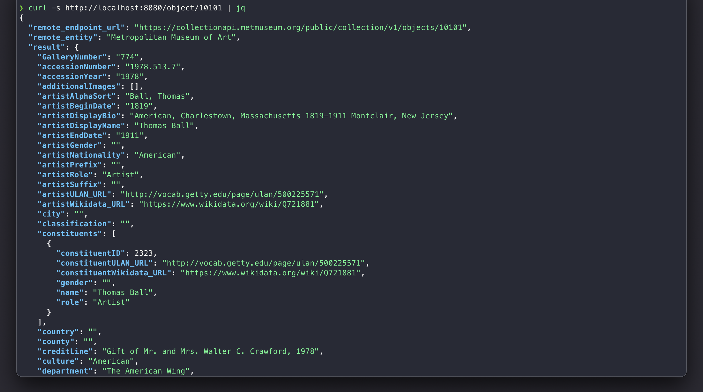

# Sample Python Api Setup

A sample python-api service that retrieves data from [The Metropolitan Museum of Art Collection API](https://metmuseum.github.io/) about objects on display in the museum.

## Repo structure
- `app` - Flask app module
- `images` -  supporting images for README.md
- `helm` - Helm charts for python-api deployment (via skaffold)

## Basic usage
Available endpoints:

`/` or `/index` - returns information about a default object on display in the museum - Japanese Hanging scroll "Quail and Millet" created by Kiyohara Yukinobu

Example output:
```json
{
  "remote_endpoint_url": "https://collectionapi.metmuseum.org/public/collection/v1/objects/45734",
  "remote_entity": "Metropolitan Museum of Art",
  "result": {
    "GalleryNumber": "",
    "accessionNumber": "36.100.45",
    "accessionYear": "1936",
    "additionalImages": [
      "https://images.metmuseum.org/CRDImages/as/original/DP251138.jpg",
      "https://images.metmuseum.org/CRDImages/as/original/DP251120.jpg"
    ],
    "artistAlphaSort": "Kiyohara Yukinobu",
    "artistBeginDate": "1643",
    "artistDisplayBio": "Japanese, 1643\u20131682",
    "artistDisplayName": "Kiyohara Yukinobu",
    "artistEndDate": "1682",
    "artistGender": "Female",
    "artistNationality": "Japanese",
    ...
    "title": "Quail and Millet"
  },
  "status_code": 200
}
```

`/object/{id}` - returns information about the object with id `{id}` on display in the museum 

Example output for the endpoint `/object/10101`:
```json
{
  "remote_endpoint_url": "https://collectionapi.metmuseum.org/public/collection/v1/objects/10101",
  "remote_entity": "Metropolitan Museum of Art",
  "result": {
    "GalleryNumber": "774",
    "accessionNumber": "1978.513.7",
    "accessionYear": "1978",
    "additionalImages": [],
    "artistAlphaSort": "Ball, Thomas",
    "artistBeginDate": "1819",
    "artistDisplayBio": "American, Charlestown, Massachusetts 1819\u20131911 Montclair, New Jersey",
    "artistDisplayName": "Thomas Ball",
    "artistEndDate": "1911",
    "artistGender": "",
    "artistNationality": "American",
    ...
    "title": "La Petite Pens\u00e9e"
  },
  "status_code": 200
}
```


## How to test the app locally with Docker
On the repo root run the following command to build an image:
```
docker build -t localhost:python-api .
```
Run docker image:
```
docker run --rm -p 8080:8080 -d --name api localhost:python-api
```
Open your browser at `http://localhost:8080` and browse the app webpage.

## How to deploy the app locally
Local deployment is done using **minikube** and **skaffold** for deploying helm charts to the cluster

> - **Minikube** installation guide: https://minikube.sigs.k8s.io/docs/start/
> - **Skaffold** installation guide: https://skaffold.dev/docs/install/

### Setup
Start minikube with a custom profile:
```
minikube start --profile custom
skaffold config set --global local-cluster true
eval $(minikube -p custom docker-env)
```
Run the following command to use Skaffold:
```
skaffold dev
```
Run on a separate terminal (Do not close the terminal window!):
```
minikube tunnel -p custom
```
Open your browser at `http://localhost:8080` and browse the app webpage:



Or run `curl` command on your terminal:

```
curl -s http://localhost:8080/object/10101 | jq
```

